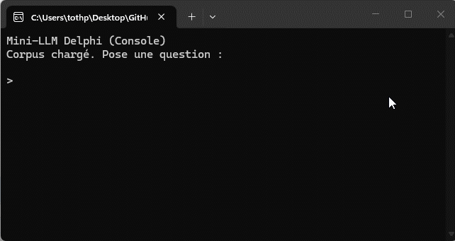
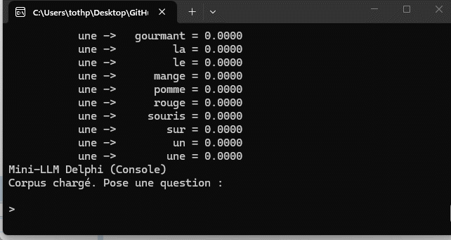

# MiniLLM
A tiny, fully explainable language model implemented in pure Delphi.

MiniLLM is an experimental project exploring how far we can push a micro-LLM architecture **without any neural networks**, using only:
- Pointwise Mutual Information (PMI) embeddings  
- A weighted Markov transition graph  
- A recurrent context vector  
- Similarity-based scoring  
- Multi-sample generation with reranking  

The goal is to build a small, transparent, hackable language model that can run anywhere, understand simple questions, and generate coherent answers from a very small corpus.

A large portion of the design originates from Copilot; I mainly streamlined and optimized the implementation. And for the record: this engine is not meant to compete with OpenAI — though it may occasionally surprise you with a sensible answer :)

---

## ✨ Features

### 🔹 Pure Delphi implementation  
No external dependencies, no machine learning frameworks, no GPU.  
Just clean, readable Delphi code.

### 🔹 PMI‑based word embeddings  
Each token is represented by a PMI vector computed from the corpus.  
This creates a lightweight semantic space similar to Word2Vec, but fully deterministic.

### 🔹 Markov transition model  
Sentences are analyzed to build a weighted transition matrix between tokens.  
Weights decrease with distance, giving a local contextual structure.

### 🔹 Recurrent context vector  
During generation, each selected token updates the context vector, steering the model toward semantically relevant words.

### 🔹 N‑best generation with reranking  
MiniLLM generates several candidate answers and selects the best one using:
- cosine similarity with the question  
- Markov coherence  
- penalties for repeated tokens  
- structural anti‑loop heuristics  

This avoids degenerate loops and produces stable, meaningful answers.

---

## 📁 Project Structure

	MiniLLM/
	├── src/MiniLLM.Corpus.pas      # Tokenization, PMI vectors, sentence vectors
	├── src/MiniLLM.Markov.pas      # Transition matrix, next‑token selection
	├── src/MiniLLM.Context.pas     # Recurrent context update logic
	├── src/MiniLLM.Engine.pas      # Generation, reranking, scoring
	└── README.md                   # You are here

---

## 🧠 How It Works (Short Overview)
MiniLLM combines three simple ideas:

1. PMI embeddings
Words that frequently appear together get similar vectors.
This gives the model a notion of semantic proximity.

2. Markov transitions
The model learns which words tend to follow others.
This gives it syntactic and local contextual structure.

3. Recurrent scoring
During generation, each candidate answer is scored using:

semantic similarity

transition coherence

repetition penalties

The best candidate is returned.

This architecture is small, transparent, and easy to extend.

## 🛠 Extending MiniLLM
You can easily add:
- larger corpora
- syntactic tags
- better distance weighting
- improved reranking
- multilingual support
- custom scoring functions
- export/import of trained models

The code is intentionally simple and hackable.